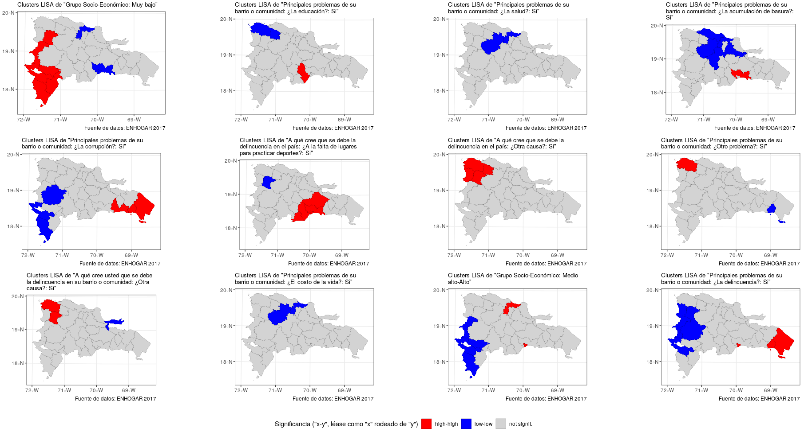
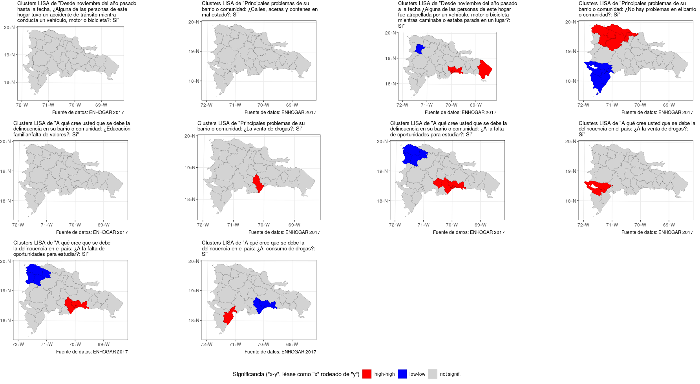

# Unidad 3. Vecindad y autocorrelación espacial

Dentro de las opciones de `knitr`, en el encabezado de este archivo, es
probable que encuentres el argumento `eval = F`. Antes de tejer debes
cambiarlo a `eval = T`, para que evalúe los bloques de código según tus
cambios.

El objetivo de esta asignación es que te familiarices con el análisis
exploratorio de datos espaciales, funciones de homogeneidad espacial,
tipos de vecindad, ponderadores y con el índice de autocorrelación
espacial de Moran.

Usarás como referencia la capa de provincias dominicanas y los
resultados de la Encuesta Nacional de Hogares de Propósitos Múltiples de
2017 (ENHOGAR-2017, descripción
[aquí](https://www.one.gob.do/encuestas/enhogar), datos fuente
[aquí](http://redatam.one.gob.do/cgibin/RpWebEngine.exe/PortalAction?&MODE=MAIN&BASE=ENH2017&MAIN=WebServerMain.inl)).
Te asigno una pregunta a continuación, sobre la cual realizarás análisis
de autocorrelación al final de la práctica.

## Pregunta asignada

Toma nota de tu pregunta asignada
aleatoriamente.

``` r
#  [1] "acade, Grupo Socio-Económico: Muy bajo"                                                                                                                                                            
#  [2] "agrie, Principales problemas de su barrio o comunidad: ¿La educación?: Si"                                                                                                                   
#  [3] "aleir, Principales problemas de su barrio o comunidad: ¿La salud?: Si"                                                                                                                       
#  [4] "arqco, Principales problemas de su barrio o comunidad: ¿La acumulación de basura?: Si"                                                                                                       
#  [5] "cindy, Principales problemas de su barrio o comunidad: ¿La corrupción?: Si"                                                                                                                  
#  [6] "franc, A qué cree que se debe la delincuencia en el país: ¿A la falta de lugares para practicar deportes?: Si"                                                                               
#  [7] "geora, A qué cree que se debe la delincuencia en el país: ¿Otra causa?: Si"                                                                                                                  
#  [8] "hoyod, Principales problemas de su barrio o comunidad: ¿Otro problema?: Si"                                                                                                                  
#  [9] "ingan, A qué cree usted que se debe la delincuencia en su barrio o comunidad: ¿Otra causa?: Si"                                                                                              
# [10] "ingdi, Principales problemas de su barrio o comunidad: ¿El costo de la vida?: Si"                                                                                                            
# [11] "itac9, Grupo Socio-Económico: Medio alto-Alto"                                                                                                                                                       
# [12] "ivanv, Principales problemas de su barrio o comunidad: ¿La delincuencia?: Si"                                                                                                                
# [13] "lbine, Desde noviembre del año pasado hasta la fecha, ¿Alguna de las personas de este hogar tuvo un accidente de tránsito mientra conducía un vehículo, motor o bicicleta?: Si"              
# [14] "leona, Principales problemas de su barrio o comunidad: ¿Calles, aceras y contenes en mal estado?: Si"                                                                                        
# [15] "magda, Desde noviembre del año pasado a la fecha ¿Alguna de las personas de este hogar fue atropellada por un vehículo, motor o bicicleta mientras caminaba o estaba parada en un lugar?: Si"
# [16] "maryj, Principales problemas de su barrio o comunidad: ¿No hay problemas en el barrio o comunidad?: Si"                                                                                      
# [17] "masue, A qué cree usted que se debe la delincuencia en su barrio o comunidad: ¿Educación familiar/falta de valores?: Si"                                                                     
# [18] "mmvol, Principales problemas de su barrio o comunidad: ¿La venta de drogas?: Si"                                                                                                             
# [19] "naui2, A qué cree usted que se debe la delincuencia en su barrio o comunidad: ¿A la falta de oportunidades para estudiar?: Si"                                                               
# [20] "rober, A qué cree usted que se debe la delincuencia en el país: ¿A la venta de drogas?: Si"                                                                                                  
# [21] "wilne, A qué cree que se debe la delincuencia en el país: ¿A la falta de oportunidades para estudiar?: Si"                                                                                   
# [22] "yoenn, A qué cree que se debe la delincuencia en el país: ¿Al consumo de drogas?: Si"
```

## Paquetes

  - Carga el paquete `sf`, la colección `tidyverse` y los paquetes
    `spdep`, `lmtest`, `tmap` y `RColorBrewer`

<!-- end list -->

``` r
library(...)
library(...)
library(...)
library(...)
library(...)
library(...)
```

## Datos y unión

  - Carga el conjunto de datos de “ENHOGAR 2017” (`.csv`), asignándolo
    al objeto `en17`. Nota que “ENHOGAR 2017” es una encuesta y, por lo
    tanto, recoge resultados referidos a una muestra, cuyo tamaño por
    provincia está recogido en la columna `muestra`. Carga también la
    capa geométrica (`.gpkg`) asignándola al objeto `prov`, y únelo a
    `en17`. Ambas fuentes se encuentran en la carpeta `data`. Recuerda
    el problema de la inconsistencia en el código entre ambas fuentes.
    Verifica consistencia luego de corregir el código (usa la práctica
    anterior como apoyo). Finalmente, une ambas fuentes, `prov` y
    `en17`.

<!-- end list -->

``` r
en17 <- read.csv('...', check.names = F)
prov <- st_read(dsn = '...', layer = '...')
en17 <- en17 %>% mutate(...)
match(..., ...)
proven17 <- prov %>% inner_join(...)
```

  - Imprime en pantalla el `sf` resultante y genera un mapa que muestre
    tu pregunta para todo el país.

<!-- end list -->

``` r
...
proven17 %>%
  dplyr::select(contains('...')) %>%
  plot(breaks = 'jenks')
```

## Conversión a `sp`

  - Convierte el objeto `proven17` a `SpatialPolygonsDataFrame`
    asignándolo a `proven17.sp`, mediante la función `as_Spatial`. Este
    paso es necesario para crear los objetos de vecindad. Verifica que
    los nombres de columnas `proven17.sp` aparecen deformados (espacios
    sustituidos por puntos), y corrígelos rescatando los nombres del
    objeto original `proven17`. Usa el [material de apoyo sobre
    vecindad](https://github.com/maestria-geotel-master/material-de-apoyo/blob/master/ref/vecindad.md)
    para guiarte (no olvides especificar el slot `@data`).

<!-- end list -->

``` r
proven17.sp <- as_Spatial(...)
colnames(...)[1:20]
colnames(...) <- ... %>% st_drop_geometry() %>% colnames
```

  - Asigna nombres de filas al objeto `proven17.sp` a partir de la
    columna `TOPONIMIA`.

<!-- end list -->

``` r
row.names(...) <- as.character(...)
```

## Vecindad por contigüidad

  - A partir de `proven17.sp`, crea un objeto de vecindad por
    contigüidad, asignándolo a `proven17.nb`, usando criterio `queen`.
    Imprime en pantalla el resumen de dicho objeto de vecindad.

<!-- end list -->

``` r
... <- poly2nb(..., queen=TRUE)
summary(...)
```

  - Evalúa la cardinalidad, es decir, cuántos vecinos tiene cada
    geometría/elemento (que en este caso son provincias).

<!-- end list -->

``` r
card(...)
```

  - Imprime en pantalla la relación de vecinos de cada geometría.

<!-- end list -->

``` r
sapply(..., function(x) x)
```

  - Haz un mapa de los vínculos de vecindad (grafo). Recuerda que
    primero debes generar un mapa de las provincias, y luego le
    superpondrás los vínculos. Usa el [material de apoyo sobre
    vecindad](https://github.com/maestria-geotel-master/material-de-apoyo/blob/master/ref/vecindad.md)
    para guiarte.

<!-- end list -->

``` r
plot(..., border="grey", lwd=0.5)
plot(..., coordinates(...), add=T)
```

  - Evalúa si el objeto de vecindad es simétrico.

<!-- end list -->

``` r
is.symmetric.nb(...)
```

## Vecindad por número de vecinos

  - A partir de `proven17.sp`, crea un objeto de vecindad por número de
    vecinos, en el que cada geometría tenga sólo un vecino, asignándolo
    a `proven17.nb.k1`. Imprime en pantalla el resumen de dicho objeto
    de vecindad. Recuerda crear un objeto de coordenadas de centroides,
    que en este ejercicio se sugiere con el nombre `coords`, y otro de
    identidades de cada geometría, para el cual se sugiere el nombre
    `ident`; ambos los usarás dentro de la función `knn2nb` (guíate con
    el [material de apoyo sobre
    vecindad](https://github.com/maestria-geotel-master/material-de-apoyo/blob/master/ref/vecindad.md)).
    El resumen del objeto `proven17.nb.k1` debería mostrar 32 vínculos,
    el mismo número de regiones de `proven17.sp`, dado que cada región
    tiene un único vínculo.

<!-- end list -->

``` r
coords <- coordinates(...)
ident <- row.names(...)
... <- knn2nb(knearneigh(..., k = ...), row.names = ident)
summary(...)
```

  - Evalúa la cardinalidad, es decir, cuántos vecinos tiene cada
    geometría/elemento (que en este caso son provincias). Dado que se
    especificó anteriormente que sólo hubiese un único vecino, el vector
    debería ser una repetición de `1`.

<!-- end list -->

``` r
card(...)
```

  - Imprime en pantalla la relación de vecinos de cada geometría.

<!-- end list -->

``` r
sapply(..., function(x) x)
```

  - Haz un mapa de los vínculos de vecindad (grafo). Recuerda que
    primero debes generar un mapa de las provincias (primera corrida de
    la función `plot`), y luego le superpondrás el mapa de los vínculos
    (segunda corrida de `plot`, con argumento `add=T`). Usa el [material
    de apoyo sobre
    vecindad](https://github.com/maestria-geotel-master/material-de-apoyo/blob/master/ref/vecindad.md)
    para guiarte. Cada provincia debería aparecer con un único vínculo.

<!-- end list -->

``` r
plot(..., border="grey", lwd=0.5)
plot(..., coordinates(...), add=T)
```

  - Evalúa si el objeto de vecindad es simétrico (no debería serlo)

<!-- end list -->

``` r
is.symmetric.nb(...)
```

  - Explora las distancias entre centroides de las geometrías a partir
    del objeto `proven17.nb.k1`. Para ello, crea un objeto denominado
    `dist` donde almacenes las distancias a partir de aplicar la función
    `nbdists` (recuerda que dentro de ésta debes colocar el objeto
    `coords`). Imprime en pantalla un resumen estadístico, y genera un
    histograma y un boxplot.

<!-- end list -->

``` r
... <- unlist(nbdists(..., ...))
summary(...)
hist(...)
boxplot(...)
```

  - Genera un objeto con la distancia mínima (objeto `distmin` usando la
    función `min`) y otro con la máxima (objeto `distmax` usando la
    función `max`). Luego, determina qué posición ocupa en el vector
    `dist` ocupan los valores de `distmin` de `distmax`, y asígnalas a
    los objetos `indicemin` y `indicemax`, respectivamente.
    Posteriormente, utiliza dichas posiciones (`indicemin` y
    `indicemax`) dentro del índice de `ident` para determinar cuál o
    cuáles provincias se encuentran a la menor y a la mayor distancia
    en el conjunto del país.

<!-- end list -->

``` r
(distmin <- min(...)) 
(distmax <- max(...))
indicemin <- which(...==...)
ident[...]
indicemax <- which(...==...)
ident[...]
```

  - Ordena los nombres de provincias de menor a mayor distancia de
    separación con su vecino más próximo.

<!-- end list -->

``` r
ident[order(...)]
```

## Ponderadoes espaciales

  - Genera dos objetos de pesos espaciales a partir del objeto de
    vecindad por contigüidad; uno de ellos estandarizado por filas
    (asígnalo a `proven17.w.W`) y otro binario (asígnalo a
    `proven17.w.B`)

<!-- end list -->

``` r
... <- nb2listw(...)
...
... <- nb2listw(..., style = 'B')
...
```

## Autocorrelación espacial de tu variable

Explora la autocorrelación espacial de tu variable utilizando el *I* de
Moran global y el local.

  - Usando `tidyverse`, genera una columna de porcentaje de personas que
    respondió a tu pregunta respecto del tamaño de la muestra a nivel
    provincial (columna `muestra`). Ponle por nombre `mivariable_pct`.
    Genera una transformada a partir de la anterior, y ponle el nombre
    `mivariable_pct_log`. El objeto `sf` resultante asígnalo a
    `proven17_mivar_sf`.

Para `hoyod` sería de la siguiente
manera:

``` r
mivariable <- 'Principales problemas de su barrio o comunidad: ¿Otro problema?: Si'
proven17_mivar <- proven17 %>%
  st_centroid() %>% 
  select(ENLACE, mivariable=contains(mivariable), muestra) %>% 
  mutate('mivariable_pct' = mivariable/muestra*100,
         'mivariable_pct_log' = log1p(mivariable/muestra*100),
         x=unlist(map(geom,1)),
         y=unlist(map(geom,2))) %>%
  select(-muestra) %>% 
  st_drop_geometry()
proven17_mivar_sf <- proven17 %>%
  inner_join(proven17_mivar, by = 'ENLACE') %>% 
  dplyr::select(muestra, contains('mivariable'), x, y, ENLACE, TOPONIMIA)
```

Tu turno:

``` r
mivariable <- '...'
proven17_mivar <- proven17 %>%
  st_centroid() %>% 
  select(ENLACE, mivariable=contains(mivariable), muestra) %>% 
  mutate('mivariable_pct' = mivariable/muestra*100,
         'mivariable_pct_log' = log1p(mivariable/muestra*100),
         x=unlist(map(geom,1)),
         y=unlist(map(geom,2))) %>%
  select(-muestra) %>% 
  st_drop_geometry()
proven17_mivar_sf <- proven17 %>%
  inner_join(proven17_mivar, by = 'ENLACE') %>% 
  dplyr::select(muestra, contains('mivariable'), x, y, ENLACE, TOPONIMIA)
```

  - Haz un mapa que muestre la variable, tanto en su versión original
    como transformada.

<!-- end list -->

``` r
p1 <- tm_shape(...) +
  tm_fill(col = "mivariable_pct", style = 'jenks',
          palette = brewer.pal(9, name = 'Reds'), title = mivariable) +
  tm_borders(lwd = 0.5)
p2 <- tm_shape(...) +
  tm_fill(col = "mivariable_pct_log", style = 'jenks',
          palette = brewer.pal(9, name = 'Reds'), midpoint = NA, title = mivariable) +
  tm_borders(lwd = 0.5)
tmap_arrange(p1, p2)
```

  - Comprueba el supuesto de normalidad de tu variable, tanto en su
    versión original como transformada, mediante el gráfico cuantilar
    normal y la prueba de *Shapiro-Wilk*.

> Tip: Como argumento de las funciones a continuación, usa la forma
> vectorial de tu variable original y transformada;
> e.g. proven17\_mivar\_sf$mivariable\_pct\_log

> Tip: Si los puntos del gráfico cuantilar normal siguen una línea
> recta, y la prueba de Shaprio-Wilk resulta no significativa (es decir,
> el valor de *p* mayor que 0.05), entonces se asume como válido el
> supuesto de normalidad.

``` r
qqnorm(...) #Versión original de la variable
shapiro.test(...) #Versión original de la variable
qqnorm(...) #Versión transformada de la variable (log)
shapiro.test(...) #Versión transformada de la variable (log)
```

  - Interpreta el resultado de la comprobación anterior aquí:

  - Comprueba el supuesto de homocedasticidad de tu variable respecto de
    `x` e `y`, tanto en su versión original como en la transformada,
    mediante la prueba de *Breusch-Pagan*.

> Tip: Si el valor de *p* es menor que 0.05 (nivel de significancia
> convencional, aunque arbitrario), existe evidencia para rechazar la
> hipótesis de homocedasticidad.

``` r
... %>% lm(mivariable_pct ~ x, .) %>% bptest()
... %>% lm(mivariable_pct ~ y, .) %>% bptest()
... %>% lm(mivariable_pct_log ~ x, .) %>% bptest()
... %>% lm(mivariable_pct_log ~ y, .) %>% bptest()
```

  - Interpreta el resultado de la comprobación anterior aquí:

En la eventualidad de que el supuesto normalidad y el de
homocedasticidad no se cumplan, continúa con el procedimiento de estimar
la autocorrelación la versión original o la transformada de tu variable,
según elijas, aun cuando los resultados del análisis de autocorrelación
espacial podrían no ser fiables.

## Autocorrelación espacial global

  - Comprueba primero que existe consistencia en la secuencia de los
    nombres del objeto de vecindad y el
*sf*.

<!-- end list -->

``` r
match(attr(proven17.w.W$neighbours, "region.id"), proven17_mivar_sf$TOPONIMIA)==1:32
```

  - Aplica la prueba de autocorrelación espacial global para el *I* de
    Moran, usando los pesos estandarizados por filas como los binarios.

<!-- end list -->

``` r
(gmoranw <- moran.test(x = ..., listw = ...))
(gmoranb <- moran.test(x = ..., listw = ...))
```

  - Interpreta el resultado de la comprobación anterior aquí:

> Tip: Si el valor de *p* obtenido fue menor de 0.05, hay evidencia
> preliminar para rechazar la hipótesis nula de “no hay autocorrelación
> espacial”, y por lo tanto concluir que “sí hay autocorrelación
> espacial”. En cualquier caso, es necesario que continúes evaluando la
> autocorrelación a nivel local en el siguiente paso, con independencia
> del resultado obtenido en la prueba global.

  - Evalúa la autocorrelación espacial local. Realiza el diagrama de
    dispersión de Moran (*Moran scatterplot*), mediante la función
    `moran.plot`. Posteriormente, carga el script `lisaclusters.R`, y
    ejecuta la función `lisamap` a tus datos para generar el mapa LISA.
    En la función `lisamap`, deberás introducir los siguientes
    argumentos: `objesp`, que es el objeto espacial denominado
    `proven17_mivar_sf`; `pesos`, que es el objeto de pesos, que será
    `proven17.w.W`.

Para `hoyod` sería de la siguiente
manera:

``` r
moran.plot(x = proven17_mivar_sf$mivariable_pct_log, listw = proven17.w.W)
source('lisaclusters.R')
lisamap(objesp = proven17_mivar_sf,
        var = 'mivariable_pct_log',
        pesos = proven17.w.W,
        tituloleyenda = 'Significancia\n("x-y", léase\ncomo "x"\nrodeado de "y"',
        leyenda = T,
        anchuratitulo = 1000,
        tamanotitulo = 16,
        fuentedatos = 'ENHOGAR 2017',
        titulomapa = paste0('Clusters LISA de respuestas a la pregunta:\n"', mivariable, '"'))
```

Tu turno:

``` r
moran.plot(x = ..., listw = ...)
source('lisaclusters.R')
lisamap(objesp = ...,
        var = '...',
        pesos = ...,
        tituloleyenda = 'Significancia\n("x-y", léase\ncomo "x"\nrodeado de "y"',
        leyenda = T,
        anchuratitulo = 1000,
        tamanotitulo = 16,
        fuentedatos = 'ENHOGAR 2017',
        titulomapa = paste0('Clusters LISA de respuestas a la pregunta:\n"', mivariable, '"'))
```

  - Interpreta el resultado anterior aquí:

> Tip: Si existe relleno rojo o azul, o ambos, significa que existe
> autocorrelación local. El relleno rojo (*hotspots*) significa que los
> valores altos del grupo coloreado son parecidos entre sí. Un patrón de
> varias provincias coloreadas de rojo se atribuye a “efecto de
> contagio” importante. Si sólo una provincia aparece en rojo,
> significa que las provincias de su entorno tienen valores parecidos,
> pero éstas últimas a su vez no tienen valores significativamente
> parecidos con su entorno ulterior (no se produce “contagio”). El
> relleno azul (*coldspots*) se interpreta de la misma manera que en el
> caso anterior, pero con los valores en este caso son bajos. Si sólo
> aparecen rellenos grises, significa que no hay autocorrelación local,
> y las provincias entonces presentan un patrón aleatorio de la variable
> analizada.

> A modo de verificación, los mapas LISA de todas las variables
> asignadas se transcriben a continuación. Nota que, de las variables
> asignadas, algunas no presentan autocorrelación espacial local.




